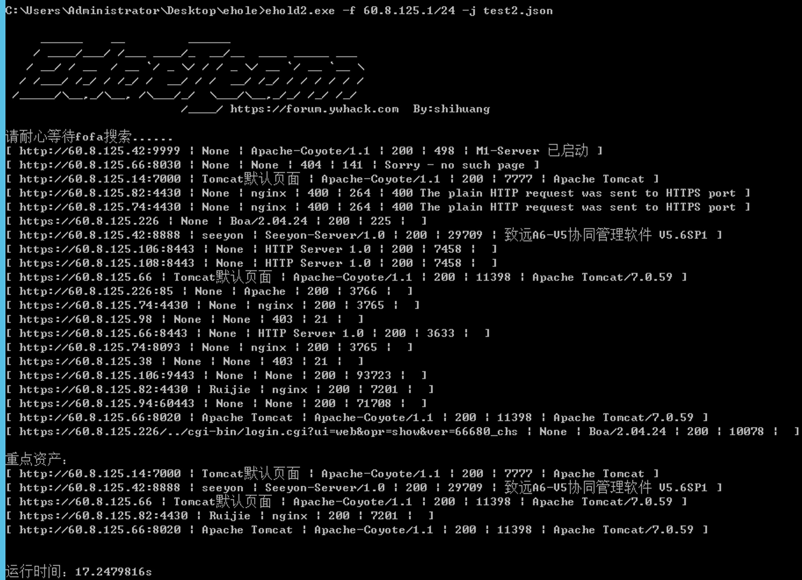
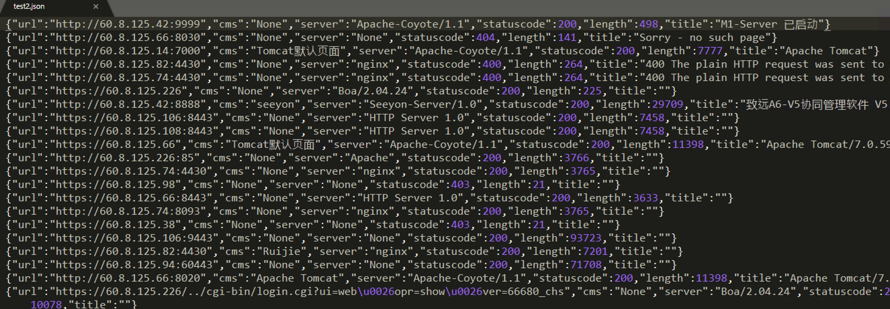

# EHole(棱洞)3.0 重构版（二开新增hunter接口）

   

### [# 00x01] 简介：

```
     ______    __         ______
    / ____/___/ /___ ____/_  __/__  ____ _____ ___
   / __/ / __  / __ `/ _ \/ / / _ \/ __ `/ __ `__ \
  / /___/ /_/ / /_/ /  __/ / /  __/ /_/ / / / / / /
 /_____/\__,_/\__, /\___/_/  \___/\__,_/_/ /_/ /_/
			 /____/ https://forum.ywhack.com  By:shihuang         
```

EHole是一款对资产中重点系统指纹识别的工具，在红队作战中，信息收集是必不可少的环节，如何才能从大量的资产中提取有用的系统(如OA、VPN、Weblogic...)。EHole旨在帮助红队人员在信息收集期间能够快速从C段、大量杂乱的资产中精准定位到易被攻击的系统，从而实施进一步攻击。

**20210823 Ehole 开源版，本次优化内容如下：**


* 1.支持xlsx导出结果
* 2.支持自定义语法导出fofa结果
* 2.支持自适应favicon的路径

感谢 Ehole 开源作者 @shihuang

**20210623 EHole(棱洞)3.0版本，更新内容如下：**

* 1.多个CMS指纹识别(如一个URL同时匹配多个CMS指纹则会同时显示);
* 2.颜色高亮(新增颜色高亮，识别到的系统会以红色进行显示，更易于区分);
* 3.新增FOFA批量端口提取(如拿到一万甚至十万IP的情况，则可以使用-fall批量从FOFA中提取端口信息);
* 4.优化多个识别规则，更易于识别重点系统;
* 5.新增多条指纹,目前能识别大部分常见的系统;
* 6.优化文件读取,更快速准确的识别内容;
* 7.FOFA语法搜索优化,使用-fofa参数快速从fofa提取资产进行识别。

**20230511 EHole(棱洞)3.0版本，更新内容如下：**

* 新增hunter接口。

### [# 00x02] 使用：

配合[红队中易被攻击的一些重点系统漏洞整理]食用效果更佳：https://forum.ywhack.com/bountytips.php?Vulnerability

```bash

     ______    __         ______
    / ____/___/ /___ ____/_  __/__  ____ _____ ___
   / __/ / __  / __ `/ _ \/ / / _ \/ __ `/ __ `__ \
  / /___/ /_/ / /_/ /  __/ / /  __/ /_/ / / / / / /
 /_____/\__,_/\__, /\___/_/  \___/\__,_/_/ /_/ /_/
                         /____/ https://forum.ywhack.com  By:shihuang

    EHole是一款对资产中重点系统指纹识别的工具，在红队作战中，信息收集
是必不可少的环节，如何才能从大量的资产中提取有用的系统(如OA、VPN、Web
logic...)。EHole旨在帮助红队人员在信息收集期间能够快速从C段、大量杂乱
的资产中精准定位到易被攻击的系统，从而实施进一步攻击。

Usage:
  ehole [command]

Available Commands:
  finger      ehole的指纹识别模块
  fofaext     ehole的fofa提取模块
  help        Help about any command

Flags:
      --config string   config file (default is $HOME/.ehole.yaml)
  -h, --help            help for ehole
  -t, --toggle          Help message for toggle

Use "ehole [command] --help" for more information about a command.

```

```
$ ehole.exe finger -h
从fofa或者本地文件获取资产进行指纹识别，支持单条url识别。

Usage:
  ehole finger [flags]

Flags:
  -f, --fip string      从fofa提取资产，进行指纹识别，仅仅支持ip或者ip段，例如：192.168.1.1 | 192.168.1.0/24
  -s, --fofa string     从fofa提取资产，进行指纹识别，支持fofa所有语法
  -h, --help            help for finger
  -a, --hip string      从hunter提取资产，进行指纹识别，仅仅支持ip或者ip段，例如：192.168.1.1 | 192.168.1.0/24
  -b, --hunter string   从hunter提取资产，进行指纹识别，支持hunter所有语法
  -l, --local string    从本地文件读取资产，进行指纹识别，支持无协议，列如：192.168.1.1:9090 | http://192.168.1.1:9090
  -o, --output string   输出所有结果，当前仅支持json和xlsx后缀的文件。
  -p, --proxy string    指定访问目标时的代理，支持http代理和socks5，例如：http://127.0.0.1:8080、socks5://127.0.0.1:8080
  -t, --thread int      指纹识别线程大小。 (default 100)
  -u, --url string      识别单个目标。

Global Flags:
      --config string   config file (default is $HOME/.ehole.yaml)
```

EHole(棱洞)2.0提供了**两种**指纹识别方式，可从本地读取识别，也可以从FOFA进行批量调用API识别(需要FOFA密钥)，同时支持结果JSON格式输出。

**1.本地识别：**

```bash
EHole -l url.txt   //URL地址需带上协议,每行一个
```

**2.FOFA识别:**

注意：从FOFA识别需要配置FOFA 密钥以及邮箱，在config.ini内配置好密钥以及邮箱即可使用。

```bash
EHole -f 192.168.1.1/24  //支持单IP或IP段
```

**3.结果输出：**

```bash
EHole -l url.txt -json export.json  //结果输出至export.json文件
```

### [# 00x03] 指纹编写：

EHole(棱洞)2.0改变了原有的指纹识别规则，2.0版指纹从外部文件读入，识别方式：

**指纹格式：**

```json
关键字匹配：
{
		"cms": "seeyon",
		"method": "keyword",
		"location": "body",
		"keyword": ["/seeyon/USER-DATA/IMAGES/LOGIN/login.gif"]
}
```

```json
faviconhash匹配：
{
		"cms": "CapRover",
		"method": "faviconhash",
		"location": "body",
		"keyword": ["988422585"]
}
```

1. cms：系统名称
2. method：识别方式 (支持三种识别方式，分别为：keyword、faviconhash、regula)
3. location：位置（指纹识别位置，提供两个位置，一个为body，一个为header）
4. keyword：关键字（favicon图标hash、正则表达式、关键字）

⚠️注意：keyword支持多关键字匹配，需要所有关键字匹配上才能识别。如：

```json
"keyword": ["sys/ui/extend/theme/default/style/icon.css", "sys/ui/extend/theme/default/style/profile.css"]
```

### [# 00x04] 使用效果：

**fofa识别：**



**输出效果：**


