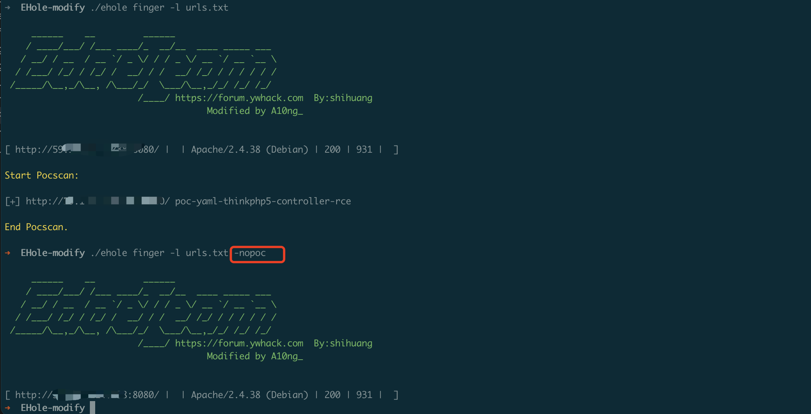

# EHole(棱洞) 二开新增hunter接口、poc扫描功能）


## [# 00x01] 简介：

```
     ______    __         ______                 
    / ____/___/ /___ ____/_  __/__  ____ _____ ___ 
   / __/ / __  / __ `/ _ \/ / / _ \/ __ `/ __ `__ \
  / /___/ /_/ / /_/ /  __/ / /  __/ /_/ / / / / / /
 /_____/\__,_/\__, /\___/_/  \___/\__,_/_/ /_/ /_/ 
                         /____/ https://forum.ywhack.com  By:shihuang
                                                     Modified by A10ng_
```

ehole用起来很方便，从见上的第一眼就爱上了，原作者不更新了，使用中感觉少了很多功能，没办法了就自己二开一下，二开的目的旨在于一把梭，自己写有点麻烦，只能当下裁缝了。。

目前添加了hunter的接口，可以从hunter直接拉数据。cv了一下fscan的poc功能，可以支持poc扫描，可以让xdm一键拣到烂洞。。。至于为什么要用fscan的poc扫描，原因是poc是独立分离的yml文件，增加poc更加方便。（本来想用nuclei的，但是有点麻烦放弃了

有bug欢迎师傅们提出来，但我不一定改。。。（主要是没时间


## [# 00x02] 使用：

### 指纹识别

EHole(棱洞)提供了**3种**指纹识别方式，可从本地读取识别，也可以从 FOFA 和 HUNTER 进行批量调用API识别(需要密钥)，同时支持结果JSON格式输出。

**1.本地识别：**

```bash
./ehole -l urls.txt   //URL地址需带上协议,每行一个
```

**2.FOFA识别:**

注意：从FOFA识别需要配置FOFA 密钥以及邮箱，在config.ini内配置好密钥以及邮箱即可使用。

```bash
# 支持单IP或IP段
./ehole finger  -f 192.168.1.1/24  

# 支持fofa语法
./ehole finger  -s domain="xx.com"
```
**3.HUNTER识别:**

注意：从配置hunter的key在config.ini内即可使用。

至于参数用a和b是当时在hw的时候改的工具，懒得去想了，如果有下一个参数我准备用c。
```bash
# 支持单IP或IP段
./ehole finger  -a 192.168.1.1/24  

# 支持hunter语法
./ehole finger  -b domain="xx.com"
```

**.结果输出：**

```bash
./ehole finger  -l url.txt -json export.json  //结果输出至export.json文件
```
## 资产提取

原来就支持fofa的，我二开的时候hunter接口忘加这里了。。。问题不大，反正我也不用
```bash
# 从fofa提取资产，支持fofa所有语法，默认保存所有结果。
./ehole  fofaext -s ip="192.168.1.1/24"

# 从文本获取IP，在fofa搜索，支持大量ip，默认保存所有结果。
./ehole fofaext -l x.txt
```


### [# 00x04] 使用效果：




## 更新日志

**20231125 EHole(棱洞)二开版本，更新内容如下：**


* 新增poc扫描功能


**20230511 EHole(棱洞)二开版本，更新内容如下：**

* 新增hunter接口、加了些指纹


二开自项目：https://github.com/EdgeSecurityTeam/EHole

poc代码来自：https://github.com/shadow1ng/fscan
